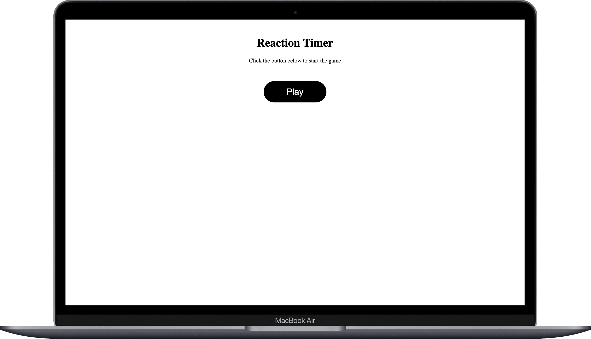
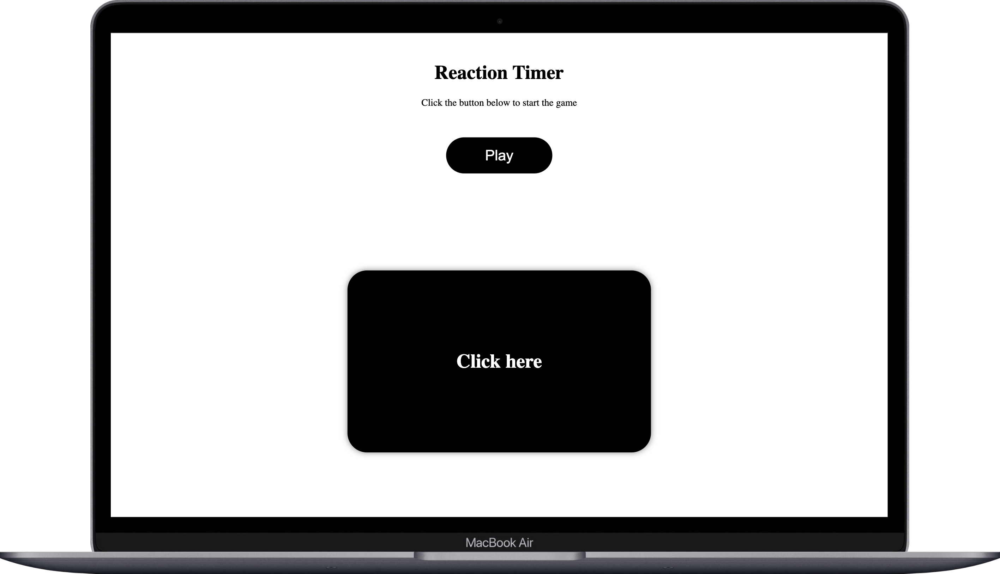
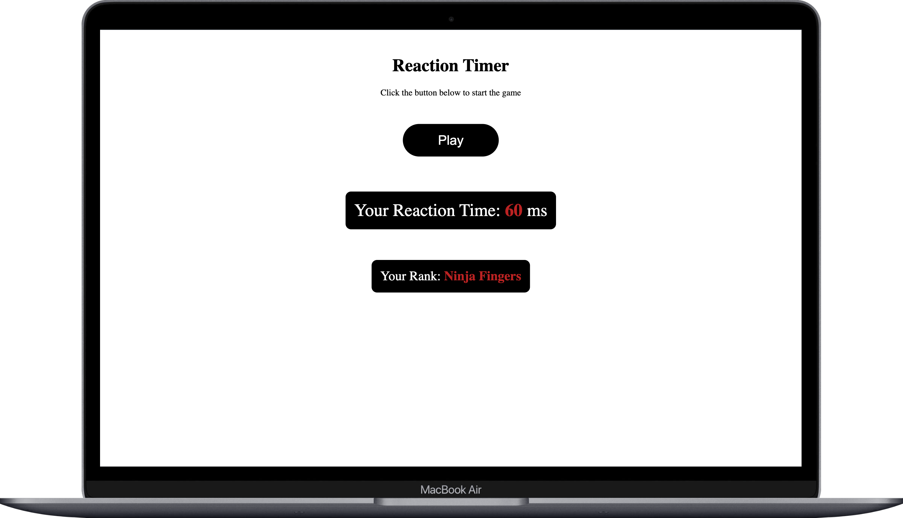

# Reaction Timer ⏱️

A simple and fun project to test your reaction time using a visual cue. This application challenges users to click as quickly as possible when prompted and records the reaction time in milliseconds. It is built with **Vue.js** and is a great way to practice your front-end development skills.

---

## How to Play 🎮

- Once the app is running, click "Start."
- Wait for the screen color to change.
- As soon as the screen changes, click as quickly as possible.
- Your reaction time will be displayed on the screen.

---

## Project Preview 📸

Here are some preview images of the project in action:

  
  

  

---

## Contact 📬

If you have any questions or feedback, feel free to reach out:

- **Email**: [contact@ahamam.com](mailto:contact@ahamam.com)
- **LinkedIn**: [AhmedHamam](https://www.linkedin.com/in/ahmed--hamam/)
